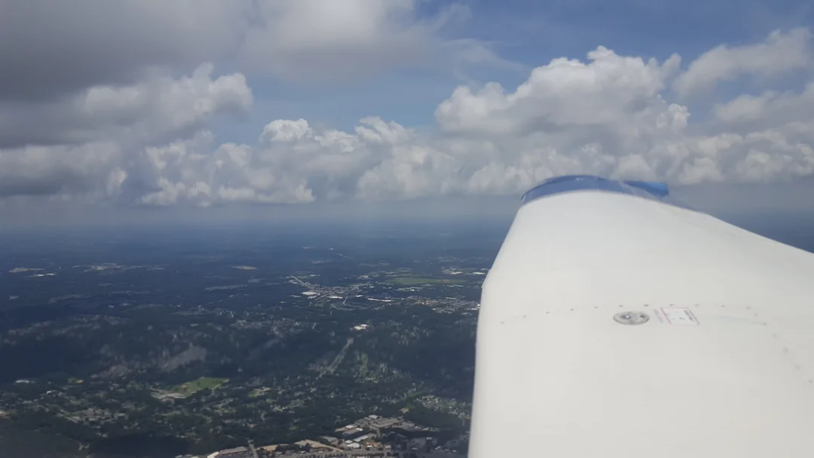

- [Synopsis](#synopsis)
- [Research Interests](#research-interests)
- [Hobbies](#hobbies)
- [Publications](#publications)

# Synopsis

I grew up in West Hartford, CT and went to Conard High School where I was able to take classes, and later work with, [Jackie Corricelli](https://sites.google.com/whps.org/corricelli). I attribute a large portion of my interest in Computer Science to her and her dedication to teaching. She also played a pivotal role in my Eagle project, helping to coordinate communication between Smith Elementary School and Conard for fostering an interest in 4th and 5th grade students in learning coding.

Starting in August 2015, I attended [Rochester Institute of Technology](https://www.rit.edu/) for Computer science and shortly added electrical engineering as a double major. I started in the BS/MS program in August 2018 and graduated Magna Cum Laude with honors in May 2020.

# Research Interests

Broadly speaking, my interest is in understanding and interacting with the world in which we live. Specifically, my interests focus on the following topics:

- Cooperative asymmetric multiagent learning
- Temporal abstractions for extended time-horizons
- Distributed learning architectures

Check out my [Research page](research.md) for a more in-depth set of ramblings on each subdomain. 

# Hobbies

I'm not a very interesting person, so I make up for it by doing interesting things.

## Cooking
### Old and Moldy Food
## Hockey
## Flying

# Publications

## [Reinforcing Inter-Class Dependencies in the Asymmetric Island Model (GECCO ’24, Best paper nomination)](https://doi.org/10.1145/3638529.3654213)

Full publication will be available following the conference conclusion on July 18th, 2024.

> Multiagent learning allows agents to learn cooperative behaviors necessary to accomplish team objectives. However, coordination requires agents to learn diverse behaviors that work well as part of a team, a task made more difficult by all agents simultaneously learning their own individual behaviors. This is made more challenging when there are multiple classes of asymmetric agents in the system with differing capabilities that work together as a team.
> 
> The Asymmetric Island Model alleviates these difficulties by simultaneously optimizing for class-specific and team-wide behaviors as independent processes that enable agents to discover and refine optimal joint-behaviors. However, agents learn to optimize agent-specific behaviors in isolation from other agent classes, leading them to learn egocentric behaviors that are potentially sub-optimal when paired with other agent classes.
> 
> This work introduces Reinforced Asymmetric Island Model (RAIM), a framework for explicitly reinforcing closely dependent inter-class agent behaviors. When optimizing the class-specific behaviors, agents learn alongside stationary representations of other classes, allowing them to efficiently optimize class-specific behaviors that are conditioned on the expectation of the behaviors of the complementary agent classes. Experiments in an asymmetric harvest environment highlight the effectiveness of our method in learning robust inter-agent behaviors that can adapt to diverse environment dynamics.

## [Influence-Focused Asymmetric Island Model (AAMAS ’24, Extended abstract)](https://www.ifaamas.org/Proceedings/aamas2024/pdfs/p2261.pdf)

> Learning good joint-behaviors is challenging in multiagent settings due to the inherent non-stationarity: agents adapt their policies and act simultaneously. This is aggravated when the agents are asymmetric (agents have distinct capabilities and objectives) and must learn complementary behaviors required to work as a team. The Asymmetric Island Model partially addresses this by independently optimizing class-specific and team-wide behaviors. However, optimizing class-specific behaviors in isolation can produce egocentric behaviors that yield sub-optimal inter-class behaviors.
> 
> This work introduces the Influence-Focused Asymmetric Island model (IF-AIM), a hierarchical framework that explicitly reinforces inter-class behaviors by optimizing class-specific behaviors conditioned on the expectation of behaviors of the complementary agent classes. An experiment in the harvest environment highlights the effectiveness of our method in optimizing adaptable inter-class behaviors.

## [Data Representation for Motor Imagery Classification](https://repository.rit.edu/theses/10369/)

> While much progress has been made towards the advancement of brain-controlled interfaces (BCI), there remains an information gap between the various domains involved in progressing this area of research. Thus, this research seeks to address this gap through creation of a method of representing brainwave signals in a manner that is intuitive and easy to interpret for both neuroscientists and computer scientists. This method of data representation was evaluated on the ability of the model to accurately classify motor imagery events in a timely manner.
>
> The proposed data representation of electroencephalographic signals in the form of signal images was found to be able to perform adequately in the task of motor-imagery. However, the amount of time to record enough samples was on the scale of a fifth of a second following the onset of an input from the user. This time delay represents the minimum window size needed to classify the event, meaning that to reduce this delay would require a fundamental shift in the data that is acted upon to perform classification or to generate the signal images. Furthermore, the system performed better than expected, even in the face of random data, suggesting that the system may be relying on some external factor or undesired artifact present in the data in order to perform its task.
>
> The strength of this approach came from its ability to be understood, visually examined, and altered in near-real-time in order to explore the data captured during a recording session. This was done after data had been recorded and involved altering sets of configuration parameters that affect the computations that go into generating a signal image. Namely, this included the window size, the function used to interpolate between two adjacent data points, and the amount of overlap of the windows. Effectively, this allows a researcher to playback the signal in an intuitive manner, watching for large shifts or edges in the images in order to detect large changes in the underlying data stream. Thus, while this approach may be unsuited for the task of classification, it would be an effective tool for conducting exploratory data analysis.
> 